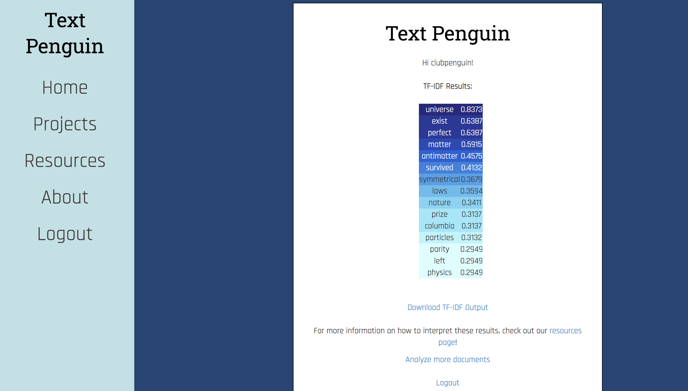
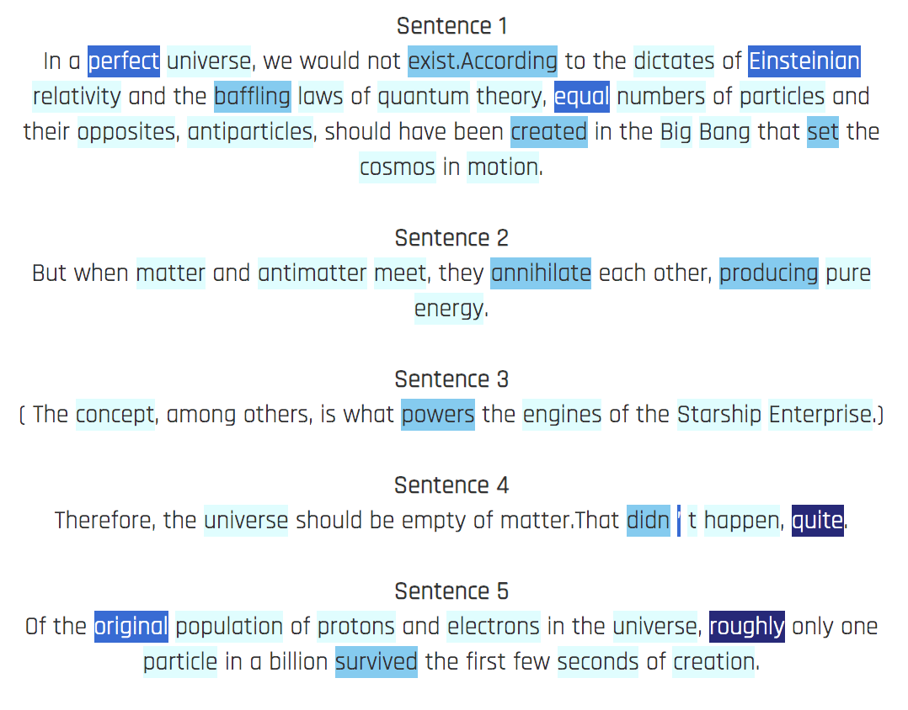
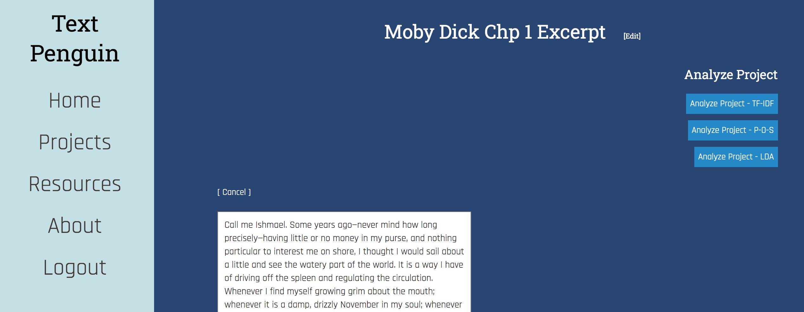

# Welcome to Text Penguin!

Text Penguin is a webapp where users can upload documents (by either copying it into a text box or uploading a .txt file) in order to have the contents of the document analyzed by three different algorithms:
Term Frequency-Inverse Document Frequency, Part-of-Speech Tagging, and Latent Direchlet Allocation. 

<b>Text Penguin gives you precise numerical results</b> 
 

## Who can use Text Penguin?

<b>Anyone!</b> Whether you are a humanities researcher, student, or someone who's just curious about text, Text Penguin was made for you. We make it both simple to analyze text and easy to analyze the results. Even if you know nothing about text analysis, we provide resources for you to get started learning about the algorithms on our [Resources Page](http://textpenguin.herokuapp.com/resources/)!

## Is it easy to use? 

Yes! Check out the video below about how to use our website: 

## Why should I use Text Penguin?

Text Penguin currently provides you access to three of the most commonly used text analysis algorithms and if you sign up for a <b>free</b> account, we give you a place to save your analyzed documents.
The documents can be saved in files called "Projects", which will act as a means to organize the documents for a single project if need be.

<b>By highlighting the results, we make them easier for you to read</b>
 

<b>By creating an account, users are able to reuse and re-analyze text</b>
 

## Where can I find Text Penguin?

Right here: [Text Penguin](http://textpenguin.herokuapp.com/)! 

We used [Heroku's](https://www.heroku.com/home) amazing deployment platform.

## How did we create Text Penguin?

Visit our [Github Repo]( https://github.com/SCCapstone/ClubPenguinFanPage)

## Have questions? 

Reach out to us or check out our [About Page]( http://textpenguin.herokuapp.com/about/)

## Authors

|Name:                 |Github:                                                  |Gmail:                                |
|----------------------|---------------------------------------------------------|--------------------------------------|
|Samyu Comandur        |[@samyuc](https://github.com/samyuc)                     |samyuktha.comandur@gmail.com          |
|Ainsley McWaters      |[@mcwatera](https://github.com/mcwatera)                 |mcwatera@gmail.com                    |
|Suzie Prentice        |[@suzanneprentice](https://github.com/suzanneprentice)   |suzanneprentice26@gmail.com           |
|Matt O’Neill          |[@oneillm71](https://github.com/oneillm71)               |matthew.oneill71@gmail.com            |
|Steven Maxwell        |[@sem15](https://github.com/sem15)                       |maxwellstevene@gmail.com              |
